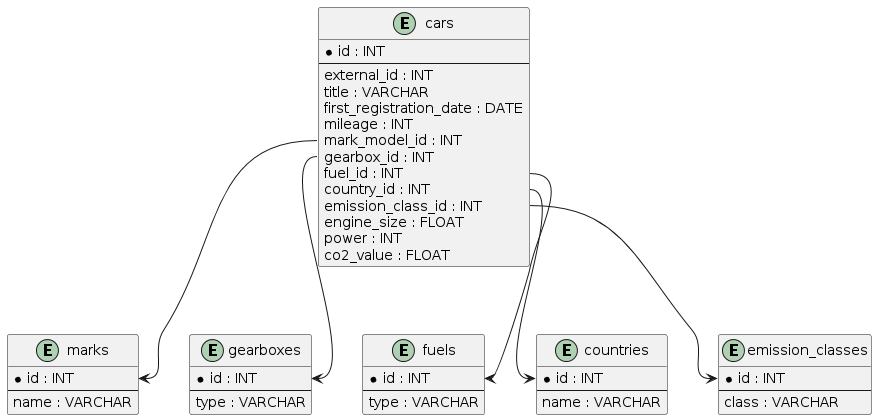

# eCarsTrade Project

## Overview
This project is designed to collect, store, and analyze car information from the eCarsTrade platform. It uses PHP for backend logic and Docker for environment setup. The project demonstrates OOP principles and avoids using PHP frameworks, instead relying on custom-built components.

## Features
- Collects car data from ecarstrade.com via Curl requests to CSV
- Stores car information in a MySQL database from CSV
- Calculates various statistics about the cars
- Auto initializating project

## Requirements
- Docker
- Docker Compose

## Setup Instructions

#### 1. Execute commands
```bash
git clone https://github.com/shahovkit/eCarsTradeParser
cd eCarsTradeParser
docker-compose up
```
#### 2. open http://localhost/
#### 3. wait until everything is ready


## Entity-Relationship Diagram (ERD)



```plantuml
@startuml
entity "cars" {
  * id : INT
  --
  external_id : INT
  title : VARCHAR
  first_registration_date : DATE
  mileage : INT
  mark_model_id : INT
  gearbox_id : INT
  fuel_id : INT
  country_id : INT
  emission_class_id : INT
  engine_size : FLOAT
  power : INT
  co2_value : FLOAT
}

entity "mark_models" {
  * id : INT
  --
  mark : VARCHAR
  model : VARCHAR
}

entity "gearboxes" {
  * id : INT
  --
  type : VARCHAR
}

entity "fuels" {
  * id : INT
  --
  type : VARCHAR
}

entity "countries" {
  * id : INT
  --
  name : VARCHAR
}

entity "emission_classes" {
  * id : INT
  --
  class : VARCHAR
}

cars::mark_model_id --> mark_models::id
cars::gearbox_id --> gearboxes::id
cars::fuel_id --> fuels::id
cars::country_id --> countries::id
cars::emission_class_id --> emission_classes::id
@enduml

